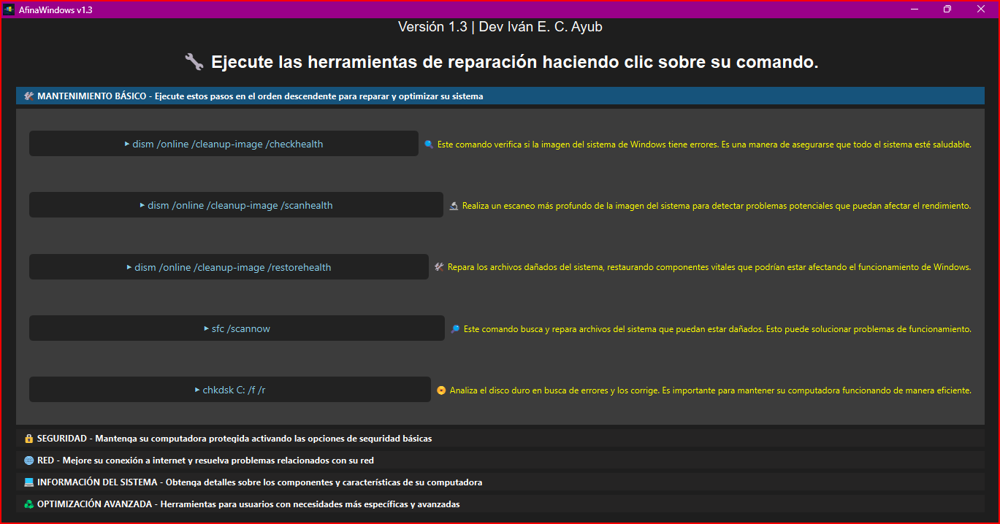

Comentario:

AfinaWindows utiliza herramientas públicas y oficiales proporcionadas por Windows para optimizar y reparar el sistema. Creemos que la información y el conocimiento deben ser accesibles para todos libremente. Si deseas aprender más sobre los comandos y tecnologías que utiliza este programa, consulta la documentación oficial de Microsoft:

- [PowerShell](https://learn.microsoft.com/en-us/powershell/) - Herramienta avanzada de automatización y administración del sistema.
- [WMIC](https://learn.microsoft.com/en-us/windows/win32/wmisdk/wmi-start-page) - Interfaz de línea de comandos para acceder a información del sistema.
- [DISM](https://learn.microsoft.com/en-us/windows-hardware/manufacture/desktop/dism-supported-platforms) - Utilidad para administrar y reparar imágenes del sistema operativo.
- [SFC](https://learn.microsoft.com/en-us/windows-server/administration/windows-commands/sfc) - Herramienta para escanear y reparar archivos protegidos del sistema.
- [CHKDSK](https://learn.microsoft.com/en-us/windows-server/administration/windows-commands/chkdsk) - Verificación y reparación de discos duros.
- [Defrag](https://learn.microsoft.com/en-us/windows-server/administration/windows-commands/defrag) - Optimizador y desfragmentador de discos.
- [Task Scheduler](https://learn.microsoft.com/en-us/windows/win32/taskschd/task-scheduler-start-page) - Programación automática de tareas en Windows.

# AfinaWindows

Desarrollado por Iván Eduardo Chávez Ayub

**AfinaWindows** es una aplicación de escritorio diseñada para optimizar, reparar y mejorar el rendimiento de Windows a través de comandos avanzados de mantenimiento, seguridad y red. Su interfaz intuitiva, construida con PyQt6, facilita el acceso a estas herramientas.

# Descarga

[Haz clic aquí para descargar la aplicación](AfinaWindows.exe](https://drive.google.com/file/d/1sWI1DmgsZ7z0v8qtPX9Ju0pe0HKfVf-a/view?usp=sharing)](https://drive.google.com/file/d/1sWI1DmgsZ7z0v8qtPX9Ju0pe0HKfVf-a/view?usp=sharing))

## Características Principales

- **Mantenimiento del sistema:** Ejecuta comandos DISM, SFC y CHKDSK para verificar y reparar archivos dañados.
- **Seguridad:** Activa y restablece configuraciones del Firewall y opciones de red.
- **Optimización avanzada:** Mejora el rendimiento del sistema mediante ajustes de memoria y disco.
- **Comandos de red:** Soluciona problemas de conexión restableciendo IP y Winsock.
- **Interfaz gráfica simplificada:** Organiza comandos en categorías para facilitar su uso.

## Cómo Usar

1. **Ejecutar la aplicación:**
   - Abre **AfinaWindows.exe** con privilegios de administrador.
2. **Selecciona una categoría:**
   - Mantenimiento, Seguridad, Red, Información del Sistema, Optimización Avanzada.
3. **Haz clic en un comando:**
   - Se ejecutará en una nueva ventana de CMD.

## Capturas de Pantalla

## Requisitos del Sistema

- **Sistema Operativo:** Windows 10 o superior.

## Desarrollo

- [PyQt6](https://pypi.org/project/PyQt6/): Para la interfaz gráfica.
- [subprocess](https://docs.python.org/3/library/subprocess.html): Para la ejecución de comandos en CMD.

## Contribuciones

Si deseas contribuir:

1. Haz un fork del repositorio.
2. Realiza tus mejoras.
3. Envía un pull request.

---

Envía tus comentarios o sugerencias a [sellocasadenubes@gmail.com](mailto:sellocasadenubes@gmail.com).
